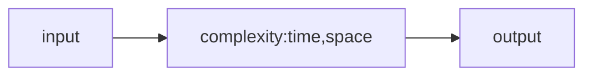

## __Study Record 모임 기록__
|          |                                |          |                                                        |
|----------|--------------------------------|----------|--------------------------------------------------------|
| 모임일시 | 2019년 08월 24일 13:00 ~ 16:00 | 모임장소 | 강남역 스터디 블룸                                     |
| 모임명   | 알고리즘 완전정복 스터디       | 참석자   | 고정완, 김인수, 윤재진, 이정배, 전태준 |
|          |                                |          |                                                        |

## 코딩인터뷰 완전분석 독파(확정)
JAVA 사용 하는 것 확정 - JUnit 이라는 test framework 사용
- solution.java --> 문제 풀이도 숙달
- test.java : JUnit 사용!(test driven development)
--> 문제 이해도 숙달
-- Java만 test framework가 통일되어 있음
- Readme.md
>이런 형식으로 3가지를 짜면서 진행
​
​
### 일반적인 테스트 프로그램

​
​
### 프론트 서비스
- 최초 : 용달서비스를 포함한 현실세계에서의 매칭
-- 현실적인 제한(마케팅, 영업 등..)
- Digital 세계에서 가능한 유통 서비스
- 게임, 대전등을 할 때 Player끼리 매칭
​
#### Spring Framework Study
- 로그인 / 회원가입 / 수정 / 탈퇴 / 방 / 매칭 등...
- OAuth2 사용 -RestAPI
- CDN만들기(image관리)
- Spring Rest Docs(문서 자동화 툴)
- 랜덤매칭 - 스코어기반 매칭 - 방 기반 매칭 순으로...
​
>프론트 서비스 + Spring 이용한 플랫폼(매칭)
> ----> **Matching Platform(Hauller : 가명)**
> -- 처음에는 게임을 기반으로 시작
​
--------------
## 본론으로 돌아와서..
### 알고리즘 스터디
#### * 테스트 주도 개발 방식
- 요구사항 :
1. input 에 대한 output 보장
2. 시간내에..
- 목표
1. <코딩인터뷰> 책 완독
2. 대회 나가기
3. 코딩 테스트
​
-----------
#### 1차 목표(다음주)
- Organization 생성(github)
1. 폴더구조
2. 브랜치 관리 정책
3. 개인 스터디 진행하고 어떻게 진행하면 좋을지, 어떤 속도로 풀면 좋을지 생각해오기(실제 문제도 풀고)

코딩인터뷰 완전분석
매칭 플랫폼
계획
매칭 플랫폼에서 사용되는 기본적인 매칭 알고리즘을 구현해보아야 한다.
배민같은 현실적인 서비스를 바로 구현하는것은 어려움이 있기 때문에 게임을 구현해서 기본적인 매칭 알고리즘을 유저들이 사용해 볼 수 있도록한다.
실제 사용자들이 서비스를 이용하는 것을 보고싶다.
우리들은 실 사용자들이 사용하는 서비스를 운영해보는 경험을 할 수 있다. 
프론트앤드
유니티 게임?
백엔드
스프링 프레임워크를 사용
TDD
OAuth2
Rest API 서버
Spring Rest Docs
로그인, 회원가입, 수정, 탈퇴
JUnit

알고리즘 + 스프링 + MP(Hauller)
깃헙 repo정책 + 폴더구조

