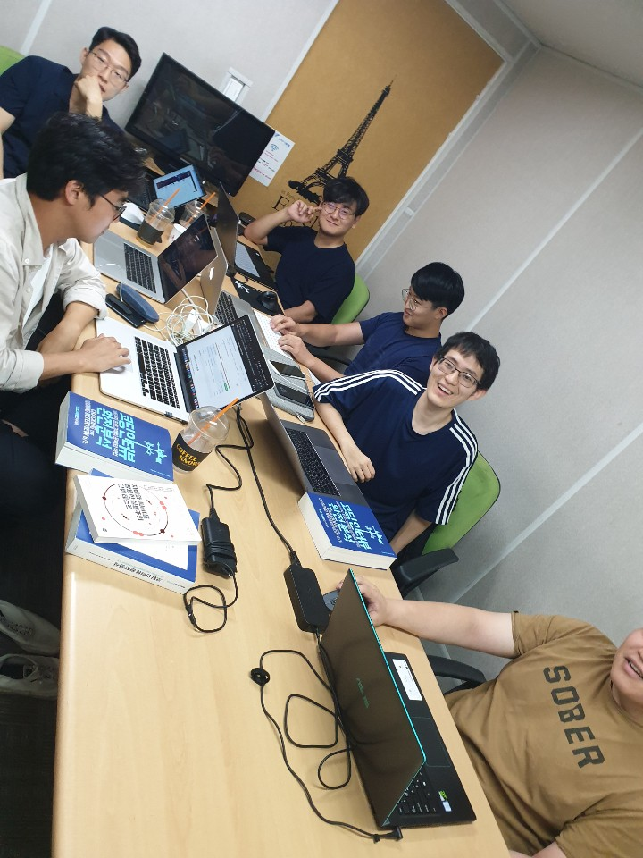

## __Study Record 모임 기록__

|          |                                |          |                                                        |
|----------|--------------------------------|----------|--------------------------------------------------------|
| **모임일시** | 2019년 09월 21일 13:00 ~ 16:00 | **모임장소** | 강남역 스터디 블룸                                     |
| **모임명**   | 알고리즘 완전정복 스터디       | **참석자**   | 강경구, 강택연, 고정완, 김인수, 윤재진, 이정배, 전태준 |
|          |                                |          |                                                        |
> ### **스터디 진행 내용**

- Junit 사용법 공유 (by 이정배)
    - Intellj 환경에서 Junit 추가하여 테스트 코드 수행가능
    - Test Driven Development
    - assertThat, equalTo ...

- 알고리즘 문제 풀이에 대한 코드 리뷰
    - 진행 방향 
        - 문제를 풀어온 사람들은 gitHub 에서 리뷰를 올리고, 리뷰 페이지에서 코드를 설명한다.
        - 다른 사람들은 설명 들으며 github 로 피드백을 준다. (이해가 안가는 코드에 대한 질문도 피드백이 될 수 있다.)
        - 리뷰된 내용이 모두 반영되거나 협의되면 mater 로 머지한다. (연습을 통해 모두가 이 과정에 익숙해지면, 오프라인 미팅이 아니라 온라인에서도 자연스럽게 이뤄질 수 있도록 하는게 목표)
    - 문제 풀이 리뷰 방법 쉐어

- Chap01 ~ Chap04 테스트 관련 인터페이스 정의

> ### **논의 내용**
- javac or IntelliJ 기반
- 스터디 진행 이전에 문제풀이 PR 올리고 Review까지 완료하고 만난다
- 실제 스터디에서는 문제에 대한 in/out 인터페이스 정의하고 다음주에 어떤 문제를 풀 것인지 정한다.

> ### **건의 사항**
- 문제풀이외에 진도나간 챕터에 대한 이론 설명에 대한 발표를 준비해보자! (by 고정완)
    - 한 챕터당 한명
    - 매주 2챕터를 나가기로 했으므로, 매주 2명 돌아가며 발표를 해보자
    - 발표를 하기 위해 개념을 정리한 문서는 아래 파일에 적어보자.
        - Chap9_Interview_Questions/0*/README.md

> ### **특이사항**

> ### **다음주 해야할 것**
- 금일 태준씨가 올린 코드에 대한 PR을 올려야 한다.
- 이번주는 새로 진도를 나가지 않고, 본격적으로 코드리뷰를 하는 시간을 가지도록한다. (각자 풀은 문제를 올리시고, 리뷰를 해달라고 닥달해주세요. 한 PR 당 최소 2사람의 approve 가 필요하도록 하겠습니다.)
- `다음주 스터디: 9월 28일(토요일) 오루 2시 신대방역`
- 각자 해야할 일 참고 https://github.com/study-records/coding-interview-study/issues/13

