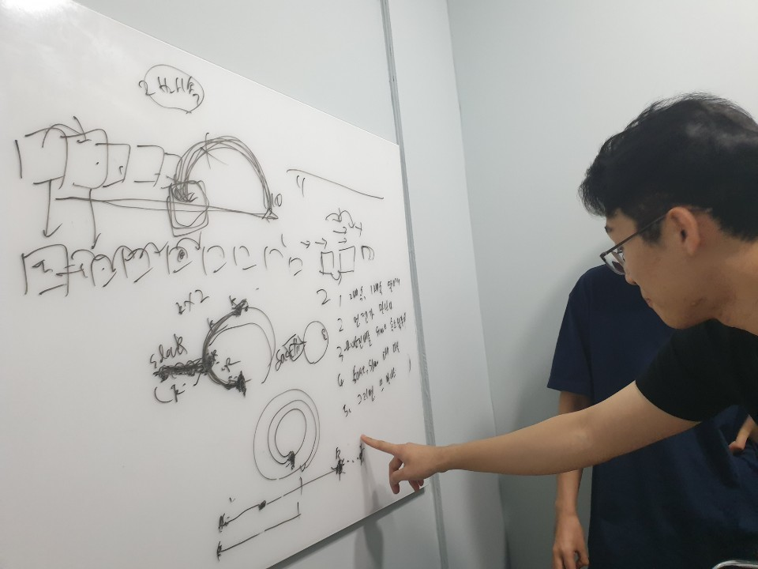
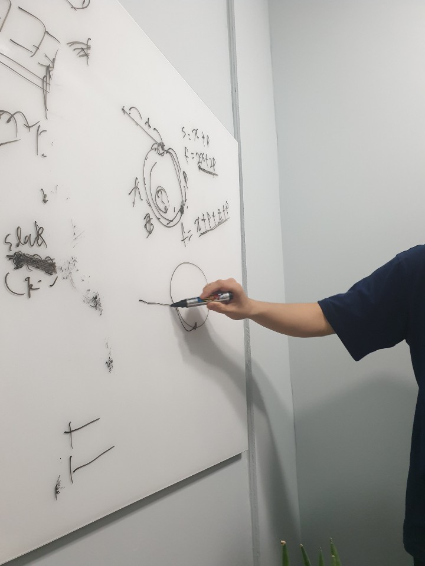
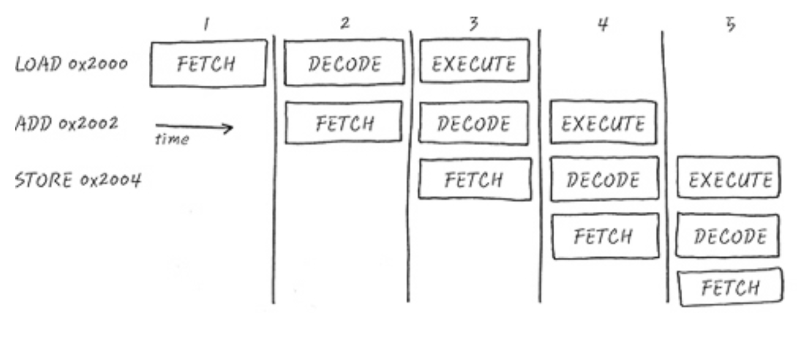

## __Study Record 모임 기록(양식)__

|          |                                |          |                                                        |
|----------|--------------------------------|----------|--------------------------------------------------------|
| **모임일시** | 2019년 09월 28일 14:00 ~ 17:00 | **모임장소** | 신림역 거북이의기적                                  |
| **모임명**   | 알고리즘 완전정복 스터디       | **참석자**   | 고정완, 김인수, 윤재진, 이정배, 전태준 |
|          |                                |          |                                                        |

> ### **스터디 진행 내용**

- 알고리즘 문제 풀이에 대한 코드 리뷰
    - 01_Arrays_And_String (by 정완)
        - 1.6_CompressStrings
            - Array, List, ArrayList 의 차이
            - StringBuilder의 장점
        - 1.7_RotateMatrix
            - Matrix
    - 02_Linked_Lists (by 정완)
        - 2.6_Permutation
            - Runner, 재귀함수
        - 2.8_LoopSearch
    - 03_Stacks_And_Queues (by 정배)
        - 이론 설명
            - Stack
                - FIFO
                - 구현 예: 모바일 뒤로가기, 브라우저 히스토리, cd ..
            - Queue
                - LIFO
                - 커맨드 파이프라인

> ### **다음주 해야할 것**
- `다음주 스터디`: **10월 5일(토요일) 오루 2시 신대방역**
- 03, 04 챕터 발표 진행
- 재귀함수 보충 설명

